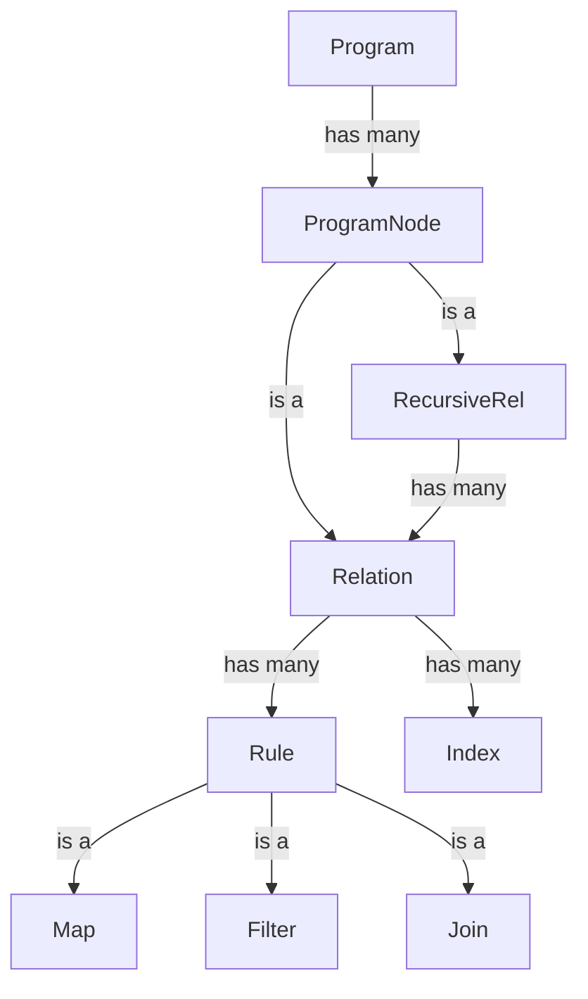
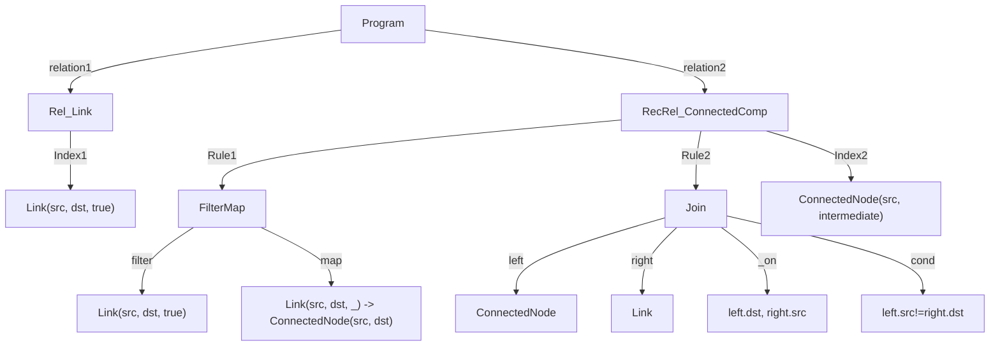

# Dev Diary

## Week 1 (09-09-2025)
1. Wrote parser for the language. Find the grammar [here](https://pest.rs/?g=N4Ig5gTghgtjURALhAdQBIEkAqBRAygAoCCAwrgAQC8FA%2BsBQDohMsA%2BrjjALsxR8y4Q%2BAkFwB2fAL6NxpAPIBZRbgBy2Cpup0GAGUyrctBcrUaOAIV3zSAaWNKV6ijMnj9hh6efaGzAPT%2BfAB%2BFAAUAISGqB6UocSqAJoAlABULrJWNvYmTho0fiD%2BqSHhWXZeefzhEcypQSzxSclpFKF1DRlugT29ff0Dg0PDI-2yPVqTU9MzWpgAImaYAGKYuABK46PbO7t7srIArgDGtACWACYApuLcZwBmZ1cQ2gACDMT4pJiYtMS6hHQxFoAFVCIQNm1wp9vr9-oCEiCVOtMKRqsxaMxWq4ADanS43O6PZ5vBhhGE-P4AoG0ayoSGiTEgZJQ8lfSnwoGqJEbVHokBM7GyAm3B5PF5aGj0Cgnc7XUXEl4cPFywlikmuWTcACeAAcrgA3BC0cSwK6k1gAclKspFRPFXVkRogJrNkooDBVdvVL1cxJxF1dMHNBQoXvl9o1sgQYCD5s0ofDasVjvEAGdjgB7fXaaVhb0p9rIJBY9Ka8SyjPZq6BgsO0NVnOhW0Rn1dFWNmuqhX1j0UTtQpM9qPprP62utlPuhiVsddusk5WnTsT5MO8sQK44uMJvuz6ur4e%2B2RZ9M70P78fdyPH8T3Q7iU6m4O%2BMPLueHm9dHX6899lfXm25Z7CBoFgUE4gTLM0EwYspC6MQ6zENgmDyKoWzgZhWFjG4FxQNwUA4pmYCvvg8iYFCUDiOImYEdwXbXMcOLpKEuDkamVE0XRDFXExr74dwEBnAARoc9FpgA-FCjE4qmMm%2BLIkxnDAuqZhA3C0DJinVD%2BNZXPc2kcPej53JmbiaBwm44vhZxmYZFAQIcOJXJpvE4rI5YCUJonia%2BzAAMQANqlF5IlieaoRhMwAA0IXcIJYX0a0RYALrSAcprxd54WvguLxFlQpRXAAHrqt4YdhlWYRhMG1TMmCKIQ8jrNgFVVe1%2BziDAmYXE5Lm6vhAAWu4MHlrLMEgJaNBQeVCl1PV9bQhFnFAaa5ZO64Zcpqnqa5fGhsw21qbw03db1zm0AN3DDZFzCraUZ2Lctq3JFJwEdR9uw1XVP2aNgiQQm1n3AwMWwUAAtJDUPQxQ2B6np9wQ9DyNg%2BsNxmhcFDXeaaaHMJ4OOc5a33GpFBMQgZw6gAdFq8PXIjBS6fTrmPOIlO2eI1QlfREDiLQunlkz%2Bks2cbOmZzBTMELBnTbpO6hHLA3QDAklQswhWy-DtBpvqxyuNzzx87pvgG7ztAANYAO5qyAumlHLz4RVjWtK7Akn68VPN81bfkgKbkgsILLsIG7vsADz2-Dzry%2BEMWR-q0eO8lrAAHzpd0-hI8jUOw-DFD4Lra3Z9DtO-jrvEKZzWjCWcYCixpdtVxwwmZpm26NxZ-YJeIsYd9UNfcAavHcGp-Pw-Z9dXGAzxj-q9kXJmeMXX3RlEfhs9XPZ3CHLqy-j03Mps2ZG-2cZxziyfB9y89aZb1HxqOx5GVptte9l7rleTDXde3Jfnct23P%2B1Q0zd17vvf%2BlMh7n1HivCgC8l4uVgfcNeDdwE6R3m-TeV8tY3zvgnB%2BZpT4PnPhzS%2B70s7FwoIQISMB2ZD1zvqIuxdIayG-vXDekwDogDYbcdOAD255ymFw-h6cQFCR7hw6crAxGizAHwyBw8YF52EZTUozAI7TUYspQiNs06B2FLcKeM9jYjWkbXcQNY1EgA0dJXi2jZJFj0V0eBwlMGcL7MwFxzl07IMzOvExUjmC%2BPwunMGzDIYUFIJmFSmYX70QYVcJhzCtQYMQcojxIAorTRfipTB2tdYsVYMkUJFYj5G3SWSU8YiTgj3yqwNgpYoRVMEjU0m5Yz4X2NpLKumggnEPFlYrJUIz6XRDirKSRZinTSyVNKEcty7HFevZZgDTpojNduMm2qzxrIHji5BZSzxDtOIaM5Wa1QzrLGTs2KayTkbLmpc5WpiYBiQtpbCZzt34V1cC8jSPsuG-JKdfHEK1zl9gdm6BWOCIBgFVq4a%2BMK1rhz2fkiut0QA3LmVrA5hTmBOPIeE8GkSzLVOgRAJJxcTwkpaWSz%2BWhQo%2BUSR8qpcZ7IMvCqrUILLHY22AKUf0gYQUgI%2BcwGQYgjkZQFbQIV3BXwCuufyp4AYHlKsxkIvs7LxIfKlTyosszQg5N3mkr5xxUwg3NYMb6v06rLBBKoUgKE0JAwtea2QHSOZ0t6SAd1dlbmPhjswIZoQYzSrOMKm2Uybb6v7K-Y1%2ByP5Fj5dNEqZUbZivsv7N5NsfUB2GSc3VrAg0UBDTKkVzIrHRsNXkhZT83AlrDbK0MMYFXTRjHNZt6qGAhoLRNUoVa42otNe9F1I6rXWpgusXACFHXoUgiO0d4grI2TMp6mamZaAAEdDjLUVGWpdAzppWQDZkkKMLQ0gIjaUMq2iIDagtlcbUEkJ7rq3Tu8Ue6tzLtzaEI9PaQDBWybGjeg6bZpWmte%2BAt772PtrcKF926QUpi4aLXUYkRCsEXtwVDJ1UwQYQHe82D7fZ4dvVYwj2pBmlETpCopRVSrlTnfOi1Y7x2zFwAADUIJO-A%2BBUKzqYy6jKgQKC4FuLeigql66yBTS8UMZV9JnGKh8kj2ooSqRAY8JTrJRaabU5uTTymaH4bU7E7gBmKBzR04pmYUpRq5OqKtF%2BYBObKmImcU4pNXN11OFRTGzdKaWzDS5TzFAB6BbTC5Xz-dW7bmzNUU8xx8LAMGg8bga0OBQAuIGXGwlqgvO3BcM4BpaBnS6K-WYNAMlUHxdGNMTmenuiq%2BnIi3naCk0a4UNSzW3M%2BfEGq7QGTfPyO4OF4LEpKuFG2a4MLQWlp9YG4UAAZHwmLbXdTqqqxrfkEQtuiBsXt3bqd0N4q264BLSWNuFAANRXdESl%2B4aXpgTdYGHfbqcaumiy9rPGl3WC3fYKwcG6d8uaSKyVnqC3WAlABwEY7IAACkJThMglNOJ6s0Bam33EPJ3T3TJjMCBzDkAwQ4dcUEBKjOVDTO6ezGtMIiWcQ4jTNFGafWSqyJZ-KqAxxjiJOZ2TVaaWWeCW1Czq43BjhU2Kdj6n1m8fhH7CC3neDIvUVol%2B%2BypKNICtPgz9yB8F4S8Ivrzu28jW0B1wfRLICt5Qe0mkWD6Ylchg9MwADtjjj2Jtpi0IWj4AONYGB%2BFOC1d0Q9ZLXZgHckDoWa4LXFvVUKRADTaaeU-R66T0WmT57uBlqmVIJgfXaIZ4jynvN-q-1Z-oznvPorC9m4uvK0vpQ-eEQLyeQXSf7pR-N-M3W8KoNJ6fSAchhAECEkGokxJFBM7CWgLztakBF66lkRQUmwlVrmh5irWQKnV2Bro6myZ5PO7MCTVCGTaaT86WeDAR3wncD0b5x6mV0nq8ytfJf9FPuKAybmmE8JWGW-UWQiClbOLUW-ffAUPgYTQLAMRLCAC4CeX%2BEFHmQieyfhUNNAk3aoe4XULA54dAg%2BGRCRVAwgnAjgKBAg6ACgigeAfAsgmg%2ByFlbfeyaOVgg%2BeACXQafmW-CeeiXgiAO-A%2BEmF0Dg0-EAU8O4CsTecVCQufK4KAc2a-SycXQ4M2cQ6oZ0GSQQ4QzuayGAYSPCXQx3TAxgnRLhFpWQ-ke4UA6wglQAzAQxaeF4XQSmcgsAlGNmFA9wmg1dVvfXBw5hCgZYFBVfQgTMeuCgNw7AzwkuO8Bg3wiwvsAIm2MvX3Oxf3C-UqMyQkN6DKFNXI24V8LJaw0QXALEHZf7fkQnV6D3L3IIyhVQQ4YMPwiwTfOIqGWQVI9xd4CgCkX4eYTAAAcRwCuzNUzkJXzlAWiKSKZwoXAPTFAWoOSL5Qay3Voi7BILkQPmgEtm1lAXsj2POEMQgFUmsnomy0OIp1kA2MuIOPERIhoD6MEC4DEFbQzDODOFoGOEGgQFxTEDeJKWOO2ItDd22WDU%2BO%2BN%2BP%2BK2TA1TGOMnjOLbnwi2JmOeLJGYAABJAoITi0oSfi-iIAAS2AwNkhxjPICSYTZNXcGthNjdMxrYqJVMBjf9ipeddRZVrgQVaEeZiZSY7iax-A9iKBRCd8GsIgskuBBAidSS4dcTKimhEh79JjACAA1CuGIjwhYrwqg8w2SLhd3UIbPUtUDJHVU4IxQKAdbLUmgzolhLqa0lYg0jJI0igc2YrAaM4OpLJH-D00Zb05OZgeE8sf0r0mkhgL-QHJxY0%2BjCYnUmGKJJYxyWlbASAwlKlM8bfVdYTdTdmMyHRGMFowkLHSYblGjLJc-WMsqGvK-ZkJ9A%2BYTR2TGIs4MW4UssmElGOSs0oZshPLcQVBtMtMVQ5csPsqVD-UMccxPb-XsjGfs5VMsWQacgcp7DJdI0U1VY9LbashjYTKYtUimKAVxc0NMoQhMro8QdgyA0MajF8Ro7OCgTAe4cGbASfcQcGXAJnU89M8JYUAQ7M5DGWOZSAhWUC2OP2b8%2B2W-Ooh85GEI0mXQVudbM8mAC8h00Q3Q32UQyjNZUeK6L2G2UWQ-OpLEaC88uCmGNGbeXmIA88jMxdNQjQm8jJTcGi79NksqfIynA8o8k8igeYNyEOcWOitChi7QtyLCrhZ0KjAhe8oTC0yhK07g0S9CoHR07grC0xZgLg343C7Io-WjaaM-B6fCX4n46yQ4CLFtKEXSng8mKyq4IMkfYHMy%2Byyy6yuTASQ2G2cGGMzivcxSx83QWAIwqAVShigwsKqS2k-Hb1fpDmfS3c2s4-aZXtHvatXWOo3c5ZEAPEk0ocrZUoGZPtIDPvXibKgKlUtSqhby2ihiginy%2BXTQRqjQ1JZgrsgtHs6ZVqvmGVSq0VLEBszucsl8RNOc4MQMXqlK1gdNA%2BCSpiEw%2Ba40TQ5uVbfUzXZYjag%2BdhbaiQpkR3aahvF3JNItMIXqmy0IXqtIAa8tFytwaaycvsC62c8DOq8Qf-aiecx6htV8Psl6iCn-f696uaYG%2BKHyztVgDcnVGjdWK9d6%2BMqY5YUmMfcG%2Bqv8u8fChG5qiTd6-mdqq3TqiskynqvG-q4coajqs8P9KsigMGr2GawauQrQhAHQ1aiga8oQ3Kg6m4xjATYGFjVjaYdYEEXQCovm-mj6WQQmFyeSHG-CaJS64tEeGAZypAQnKECAQaNMCyqARypWrWnWhyiLZylPaqqY4gFWtS6MK2%2BWlWgARjZRVoACYnbokABmR3BWmAe2kou8p2Q6AOSq39WGk9ZNOM16gyiAZyyNVwb252v2uSgOkAYi%2BszWrcY9ItZgDc7tUOncgKpW7O09WMP9fOv-AE2Om2j23wEOsa1gN0qM4M80mq9YdAfASJDy80Biw23W-Wu26JXKsnVtFWjNejUewyuG8OsqXKmS6af2m2MuiOqGqxJfHeWgYSCjYysOqOy9cVKQDFFO7HMSZAQ%2B7DByT9EStw8Qc2NMMINMCAY4JALuR4lnC4EBJ%2B7YlnEFa%2Bg4-CKyp%2B-haXTDM%2B-dD1JMixc%2BGsVQHqRJO%2Bh%2Bj%2B0BV%2B9%2B5%2B2RaXWQcB4eKBmB2%2B%2B%2B44JB7gFkdW2Y6%2BnBh%2B-B4XRyJymmOQMyCBy46B64UhvBuBEBQholDByBi4Bh2B3BlnJEyalaAQmia4ZIFnK%2Bm%2B-MU4gR1Ek0GB8hrGSh0R8IXBigHbFhgh6h2QA%2BiLZyTh9YPqE%2BvCAiFrEfIAA#editor)

    1. Given the program string we now have the syntax tree.
    2. I may have gotten too ambitious and added too many constructs.
sd
2. Came up with intermediate representation of the program, that can be executed.


Think of `Index` as intermediate computation result, which can be reused when the `relation` occurs in the RHS.

Example:-
```
// Relation 1
input relation Links(src: string, dst: string, link_status: bool)
// Relation 2
output relation ConnectedNodes(src: string, dst: string)

// Rule 1
ConnectedNodes(src, dst) :- Links(src, dst, true).
// Rule 2
ConnectedNodes(src, dst) :- ConnectedNodes(src, intermediate_node), Links(intermediate_node, dst, true), (src != dst).

// Index 1:- for Link (It appears in RHS in Rule1 and Rule2)
// Index 2:- for ConnectedNode (It appears in RHS in Rule2)
```

Compiled IR for the above example:-



#### TBD for next week:-
1. Convert `syntax tree` to `IR`.
2. `IR` to `executable`.


## Week 2 (16-09-2025)
1. Worked toward `syntax tree` to `IR` translation.

  1. Wrote the type inference engine
  2. Built Expr Syntactic Context. Expression's syntactic context determines the
kinds of expressions that can appear at this location in the program, expected
type of the expression, and variables visible within the given scope.


#### TBD for next week:-
1. Complete `syntax tree` to `IR` translation
2. `IR` to `executable`.
